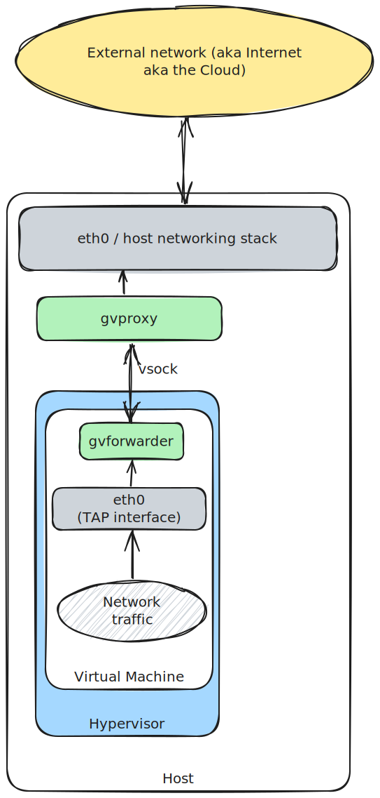

User-mode networking stack
==========================

With v1.19 CRC introduced a new network mode that allows users to work with a VPN turned on.  
Instead of using a traditional NAT, it uses a userspace network stack. The virtual machine is
now seen by the host operating system as a normal application.

## Instructions

### Windows

Since 1.32.1, the default network mode is usermode.

### macOS

Since 1.26.0, the default network mode is usermode.

* Run the tray application
* Click start or run `crc start`

### Linux

* Cleanup the previous installation of crc.  
  Run `crc delete`, `crc cleanup` and remove the folder `$HOME/.crc`
* Remove eventual *.crc.testing records in your hosts file /etc/hosts.  
* Activate the user network mode.  
 `crc config set network-mode user`
* Prepare the host machine  
 `crc setup`
* Start the virtual machine as usual  
 `crc start`

## Reaching the host from the VM

You can enable this feature with the config property `host-network-access`.

* Close the application (or the daemon) and the VM.
* crc config set host-network-access true
* Start the application (or the daemon) and the VM.

In your containers, you will be able to use `host.crc.testing` DNS name to reach the host.
It is the equivalent of `host.docker.internal` in Docker Desktop.

## Using with Docker Desktop

You can build your containers with Docker Desktop and push them to the OpenShift registry.
On macOS and Linux, you can directly use `docker login`.

On Windows, this is slightly more complicated. Please follow this guide:
- https://github.com/code-ready/crc/issues/1917#issuecomment-814037029
- or https://github.com/code-ready/crc/issues/2354#issuecomment-851320171

## What to test

* Please turn on your VPN software before and after starting CRC.  
  We would like to know if CRC behave well and if you can login to the OpenShift console (use `crc console`).
* Deploy a pod that connects to a resource on your VPN network. 

> [!CAUTION]
> Don't run Docker Desktop with Kubernetes activated and CRC side-by-side. This might lead to overlapping of ports.

## Technical details

